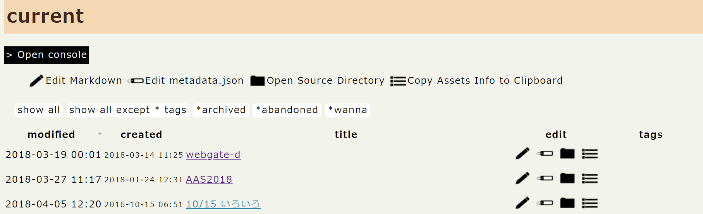
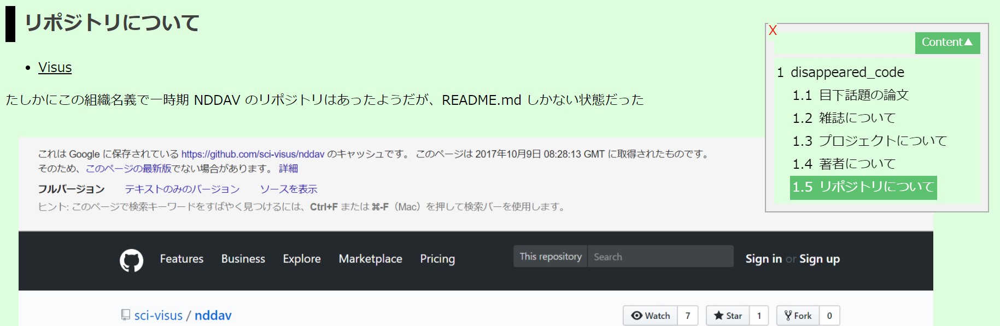
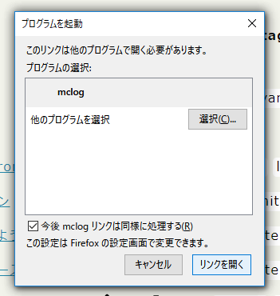

## About mclog

This is an experimental implementation of offline blogging software based on `Markup Language file Container` (hereinafter called `mc`, the specification is under development.) file. `html.mc` can be used for web-archiving and `markdown.mc` can be used for offline blogging. This management software is developed for examining such possibilities.

Simply speaking, if you manage markdown files with images and metadata in the same directory and view it on the browser using an extension like [Markdown Preview Plus](https://chrome.google.com/webstore/detail/markdown-preview-plus/febilkbfcbhebfnokafefeacimjdckgl?hl=ja), what you see is just your offline blog, isn't it?

## Setup

**Install Python**

- Latest Python3 is supported.

**Editor**

- I'm using [Atom](https://atom.io/) and the command `atom` is written directly in many scripts. If you are using any other editor, change those lines.

**Register mclog handler**

- Edit value of `[HKEY_CLASSES_ROOT\mclog\shell\open\command]` in `mclog.reg` to your `urlhandle.cmd` path.
- Right click `mclog.reg` and perform `merge` (「結合」in Japanese)

When you use click a `mclog://` handler for the first time, there can be popup like this. Click `Open the link`, `OK` or so.

**Set an instance**

- copy `instance` folder
- edit `setting.bat` to add path of instance
- edit `mc-search.bat` to add the full-text search software you are using.
    - I recommend [TresGrep](http://hp.vector.co.jp/authors/VA055804/TresGrep/) for Japanese
